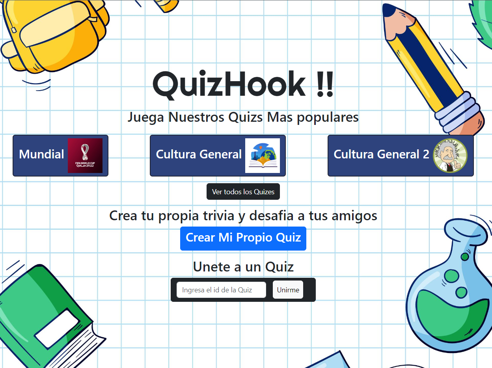
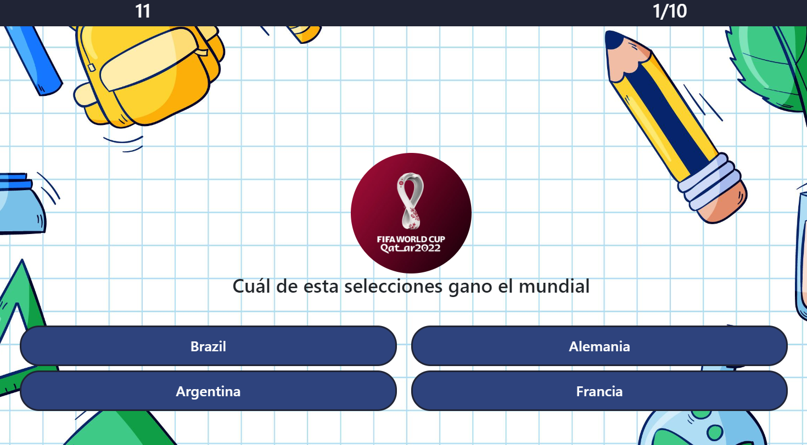
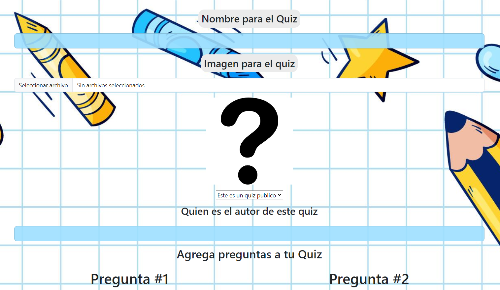
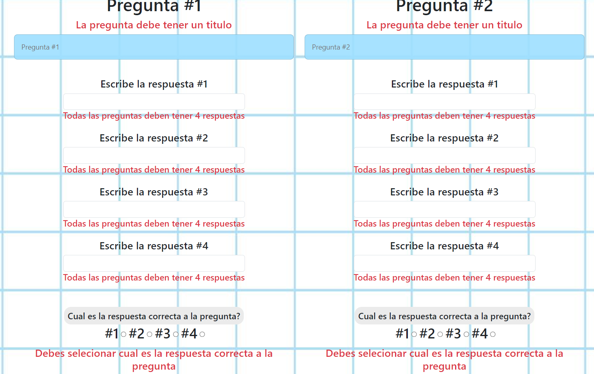
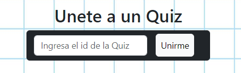
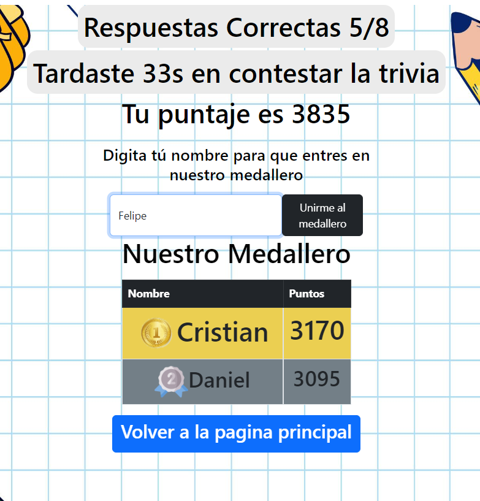

# QUIZHOOK 

Este proyecto es una Aplicación emula las funciones de Kahoot
Puedes crear tu quiz y compartirlo con tus estudiantes y amigos,
ademas tienes un leaderboard para ver los puntajes de cada persona que juega el quiz

Tambien puedes jugar quizes de otras personas y competir contra otras personas

## 🔗 DEMO:
🤖Link Demo:(https://quizhook.vercel.app/)

## Funciones de la pagina Web

Puedes Ver los Quizes más jugados

Esta es la vista donde seleccionas la respuesta que crees correcta 

Tambien puedes crear tus propios Quiz para desafiar a tus amigos o estudiantes

Cada quiz debe tener 4 preguntas como minimo y obvio tener una respuesta correcta (Validaciones con yup y formik) 

Puedes compartir el Id de un Quiz para que otros puedan jugarlo

Al contestar el Quiz puedes agregar tu puntuacion al leaderBoard y asi competir con amigos

# Lenguajes de Programación y Frameworks

  
  

    
  
    
    
  

## 🔗 Links:

## Sobre Mi 

¡Hola! Me llamo Carlos, apasionado por la programación.

Me motiva aprender cada vez más, me apasiona el desarollo, he imaginar y luego programar algo en diferentes lenguajes como Python y JavaScript

Mi objetivo principal es aprender tecnologías que me permitan desenvolverme profesionalmente como desarrollador de software.

# Herramientas

  
  
  

# 📊 GitHub Stats:

---
